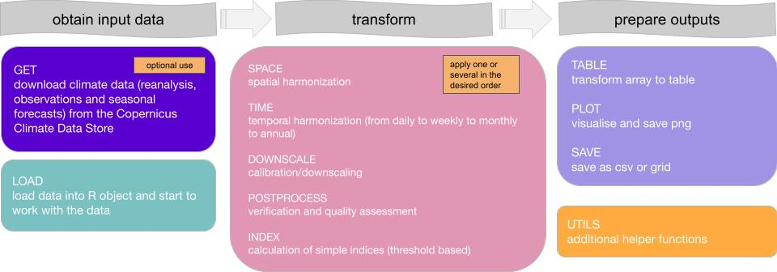

# clim4health      

<!-- badges: start -->

<!-- badges: end -->

## Overview

**clim4health** is an R package designed to obtain, transform and export climate 
data for their use in epidemiological analyses and other types of applications. 
The package contains a series of functions structured in three sequential blocks: 
input, transformation, and output. 

In the input block, **clim4health** provides functions to download several types of 
climate data including reanalyses, forecasts, hindcasts, and weather stations 
and load them into memory for their processing. The transformation block includes 
functions to postprocess and downscale climate data, perform spatiotemporal
aggregations, as well as compute threshold-based suitability indicators. Finally, 
in the output block, functions to visualize and export the transformed data are 
provided.

 

  \

**clim4health** is one of the packages developed by the
[Global Health Resilience](https://www.bsc.es/discover-bsc/organisation/research-departments/global-health-resilience) (GHR)
team at the [Barcelona Supercomputing Center](https://www.bsc.es/) (BSC) within 
the [HARMONIZE](https://www.harmonize-tools.org/) project, which comprises 
different R and Python libraries tailored for health, climate, environmental, 
and socioeconomic data acquisition, harmonisation, and visualization.

The package is currently under development and its expected release date 
is **February 2026**.

## Developers

**[Emily Ball, PhD](https://www.bsc.es/ball-emily)**
\
Barcelona Supercomputing Center\
Climate Services

**[Alba Llabrés, PhD](https://www.bsc.es/llabres-alba)**
\
Barcelona Supercomputing Center\
Climate Services

**[Carles Milà, PhD](https://www.bsc.es/mila-garcia-carles)**
\
Barcelona Supercomputing Center\
Global Health Resilience

**[Raul Capellan Fernandez, MSc](https://www.bsc.es/capellan-fernandez-raul)** \
Barcelona Supercomputing Center\
Earth Data and Diagnostics

**[Daniela Lührsen, MSc](https://www.bsc.es/luhrsen-daniela-sofie)**
\
Barcelona Supercomputing Center\
Global Health Resilience

**[Anna B. Kawiecki, PhD](https://www.bsc.es/kawiecki-peralta-ania)**
\
Barcelona Supercomputing Center\
Global Health Resilience

**[Rachel Lowe, PhD](https://www.bsc.es/lowe-rachel)**
\
Barcelona Supercomputing Center\
Global Health Resilience (Group leader)

<!--
# clim4health 

## Overview

clim4health is a tool developed within the HARMONIZE project with the aim of post-processing climate data harmonized to the spatiotemporal aggregation of health data. The tool consists in an R-package and its documentation including examples on how to use the tool and recommendations of parameter selection in some case studies. 

The functions that are part of the tool allow for:
- calibration and quality assessment of climate forecasts
- harmonization of the spatial resolution of the climate data with techniques of statistical spatial downscaling or aggregation to shapefiles
- harmonization of the temporal resolution of the climate data with aggregation to epidemiological week or coarser aggregations
- index calculation (e.g. threshold based index)
- visualization of results
- output as .csv file harmonized to the requested format

## Resources

Downscaling of Climate Data

The [downscaling tutorial](https://github.com/harmonize-tools/climate-downscaling) deepens into how to spatially downscale climate data using underlying tools in the clim4health package, using sample data and examples of the HARMONIZE project hotspots.

Organisation Website

[Harmonize](https://www.harmonize-tools.org/) is an international develop cost-effective and reproducible digital tools for stakeholders in hotspots affected by a changing climate in Latin America & the Caribbean (LAC), including cities, small islands, highlands, and the Amazon rainforest.

The project consists of resources and [tools](https://harmonize-tools.github.io/) developed in conjunction with different teams from Brazil, Colombia, Dominican Republic, Peru and Spain.

## Organizations

<table>
  <tr>
    <td align="center">
      
    </td>
    <td align="left">
      <strong>GHR</strong> 
      Global Health Resilience
    </td>
  </tr>
</table>

## Authors

 
 

  <strong>Alba Llabrés-Brustenga</strong> (developer)
  

 
 

  <strong>Daniela Lührsen</strong> (developer)
  

 
 

  <strong>Raúl Capellán Fernández</strong> (developer)

-->
